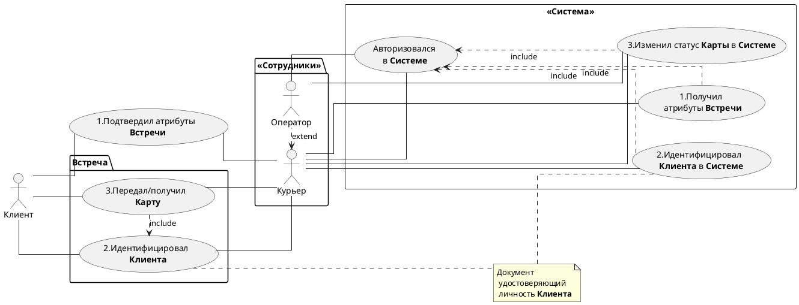

> [назад в BRD](https://github.com/vnukov-vv/AlfaCampus-SA/blob/main/HW%20MD/BRD.md)
# Домашнее задание по UML
## Use Case
> Доставка карты клиенту курьером




## Sequence 
> Заказ карты для физического лица через мобильное приложение с выдачей в отделении

![SVG](https://www.plantuml.com/plantuml/svg/dLXDRnjL5DtFhxZonf9RKzXQg6ffMR10GgnOPEEc9aGou-0uLTcWVBGDKaBJHaLKLfDGmG-Oc3YPs8dp5zxxHvoZEyz-y-5nr4e9pBntF-wvvvrt9m_MUyrkR-FdTl1mkTVfYkcRiOdDq5pRxU19vxbKpOdTD37UJimvttEr6dpLsGYVDhk_YlbWJe9M-5ImEJ5uQo9i6rM3Hvsmr-sqfM8-cjXksMtONvbeAJHlp01F4tes5oQoh_3Vk2BDTNcuFZLxzFst4do7z5QNLzUQOO_9zLClu7UaNX3mFnYsswtbtcedNEVU224Y9fvTEiR26N8PQpts87ZSx3MVDDTRylKlcM8EiMDeVzUwnI_4xbNJoRn5pFTJywh_Z-YkFclsMcc0_GUftnU2ANVkI4FCNqZznkxOBJC2NZUP7Z3dpXfY_ilo2Qe0qPTOFpDHsksNzRhwRKW5rGpC47jYbY2A3S6xPsu0roOUntQ_mXgASslCimcuZ6tedry0b-qM2eYA6XvaG6gsUr903HOBj-eSdj-pUKmBAo-mQ-HsaLY0RBjuLLCa77GpBv3Wtqgtix56vhCsEDmr4HiktpokQYAWIRvAB4kjviDcebejmDOw3MZ9u7okkroO2jurvjWo6VQ2hTPpoFxPRLBG3BYrkDVgiuBipc04xDN0xfXBedCt4wjMqvQtsZW1vWWHoBiRvJsGEPWBbY8LjbO2SUW-J-0zXd5iJea_-p-dBsI12Eip_oJSd83EOwSqM2ohaCaIVzPeOX8Hk_RCfKTJ18_fGD8KLs25l_ZpkDKiFA4PXgurkoeV4tFAg3D957D6sMDu-rBRw_5a0JMuVKOEelVEELFFO_PWaethMCrG6S4h2vlPcRTjp7Gb9cB0Dj8gLOhOfemOkGgohbWDLVE6keat8oboO2v9SI5BsIFM2RwnZ_OFCy9-XCyoVIf8XzWueFAbMY0clgUDPyw58LtlCprMJlDaawFcGWWX7QXkmdX2WlKrKxi7HEUA9NCx9PI5PLEnyjvvtfntzillS1zzpQWEBOHepQwBnHadd0910dfrLCtvzW4jPbBV5pK-kaJXwiGCuMY077PTNOw_16MR-Ahel_FYK08I9b1nQ3hn-QM-tt34e1Qo-Wlcp9FDovgXn3sgAxjlNmSb8bDsOKRGCOPW_Z16ojhB69iF6Fup4EmOBOs9bWgi47pO9LtsrJLLwP7vyvRb7a6xpsactE-gqtlSoPudGdp83mXci6X0OFVJpeKE5McxKvbBzAaTKU7csUcYPZfgtC-CRCajUk5nZlG07hlQso2plvxpq4XPiF5Z4p5pdZ9UO_HAtZaoc3W8Ez3vxkhAJxsyDvR2ueaPFIw5lttnkU096tY99QGdQhwjqphoMY_fMSqw6HRKQaRvKwhpfNgDWyIqxfpuqNM9KMT1HJ7deUBuechZqmJFZfx-7PivkN_xY4vOfRdc6EJyA86fh7Z7ytp5hNfNp94wHico-YHj3NOlrjfFcXP8xGzmxtII6Bknu909v09Zp-jPu9rQ3R9gZdWV64hPhjqd5dH8eojgMomiHDj7VuVyNou3kJWzOnrp0O5UmLLvQ_mHQmhW3q84FnsAZtXvoNwIWrV41Rh9xBLVLx8Kff6YXDuQAJTSkHybLxtmclKXrIaxWnmTbdmdLNm7ccU1WufG3Fthc6EisAraBXdbDN4AbXhn9gDxZa2-g7ZopSk17x6ikNmWu5Ibuk9kFzy5bJhpZKfFRWme-7nLAB2Ua8_ffJ_OXQy40_5GLxpfE--kE4ZXHkwSJkCwfo6eDpJgEBuKBdiJ8FgJhUuIJLxS8GU0Zsr1Xue234dBV6DAEbDoUzus3-xcaK0jdb2Kvv6_IOLEw1EZqmv5S2aiK1VDolDpaZI1wP1KzeMhXKpZ0USYGNBpIF4d3FyAGtxbqYXAWfizKZ0DWeQ8ciYvncFX9VEOb7tLPg9676QlFGsWZyYJsjpXwYFzJRlFV1WswBP-bCwpLZVLpxl2KeA5rWmay30LkmVuXJ-d_Gy0)
```
@startuml
Actor Клиент
box 'Приложение'
Boundary МП
end box
box 'Банк'
Control "Система\nАвторизации" as As
Control CRM 
Participant КК
Participant Скоринг
Collections Каталог
Collections Отделения
Database Eq
end box
box 'Внешние Системы'
Participant БКИ
end box
'''''''''''''
Activate Клиент
Клиент -> МП ++ : Запуск\nприложения
opt Форма входа
Клиент <-- МП : "Введите логин/пароль"
end
Клиент -> МП : логин/пароль
МП -> As ++ : Запрос\nавторизации

'''''''''''''
alt Авторизация
As -> As : Идентификация\nАутентификация
МП <-- As : Авторизация
    group 'Получаем ID'
As -> Eq ++ : Запрос ID **Клиента**
Eq -> Eq
As <-- Eq --
МП <- As -- : ID **Клиента**
    end
opt Приветствие
Клиент <-- МП -- : "Здравствуйте, **Клиент**"
end
else Неуспешная Авторизация
 group neg
 МП <--x As : Ошибка\nаутентификации
  opt Уведомление
  Клиент <-- МП -- : "Неправильный логин\nили пароль"
  end
 end
end
Deactivate Клиент

'''''''''''''
par Отображение данных
МП -> Eq ++ : ID **Клиента**
Eq -> Eq
МП <-- Eq -- : Данные для отображения
МП -> Каталог ++ : ID **Клиента**
Каталог -> Каталог : Формирование\nпредложения
МП <-- Каталог -- : Список предложений
opt стартовый экран
Клиент <- МП : Вывод данных и/или\nпредложений
end
end

'''''''''''''
group Заказ **Кредитной Карты**

Клиент -> МП : Выбор предложения\n **Кредитная Карта**
МП -> КК ++: Запрос на выпуск\n **Кредитной Карты** для ID
КК -> Eq ++: Запрос данных **Клиента**
КК <-- Eq --
КК -> КК : Первичная обработка
alt Данных достаточно
МП <-- КК : Анкета заполнена полностью
opt Уведомление
Клиент <-- МП : "Ваша заявка принята.\nОжидайте решения"
end
else Данных НЕ достаточно
МП <-- КК : Нужны дополнительные данные
opt Форма ввода
Клиент <-- МП : "Заполните анкету"
Клиент -> МП : Заполняет
end
end

par 
КК ->> Скоринг ++ : запрос расчета
Скоринг -> Скоринг : расчет платежеспособности
note right Скоринг : Занимает\n~10 минут
КК <<-- Скоринг -- : ответ
КК ->> БКИ ++ : запрос кредитной истории
БКИ -> БКИ
КК <<-- БКИ -- :ответ 
end

alt Положительное решение
  КК -> КК : Расчет окончательных\nпараметров предложения
  МП <-- КК : Параметры **Кредитной Карты**
  opt Уведомление
  Клиент <-- МП : "Мы выпустили Вам **Кредитную Карту**\n Назначьте время и место **Встречи**"
end
else Отрицательное решение
  group neg
  МП <--X КК
  opt Уведомление
  Клиент <-- МП : "Сейчас мы не можем \nвыпустить Вам **Кредитную Карту**"
  end
end
end
КК --
'''''''''''''
group Назначаем **Встречу**
Клиент -> МП ++ : "Назначить **Встречу**" 
opt Выбор из списка
Клиент <- МП : "Выберите\nспособ доставки" 
end
Клиент -> МП : Выбирает
alt Доставка в Отделение
МП -> Отделения ++ : Местоположение по геолокации
Отделения -> Отделения
Отделения --> МП -- : ранжированный\ncписок **Отделений**
opt Выбор из списка
МП -> Клиент : "Выберите **Отделение**"
end
Клиент --> МП : Выбирает
opt Форма ввода
МП -> Клиент : "Выберите дату и время"
end
Клиент --> МП : Заполняет атрибуты\n **Встречи**
МП -> МП : Проверка формата\nвведенных данных
МП -> CRM ++ : атрибуты **Встречи**
CRM --> МП --: Подтверждение
opt Уведомление 
Клиент <-- МП -- : **Встреча** назначена
end
else Доставка Курьером
ref over Клиент, CRM 
Доставка Курьером
end ref
end
end
@enduml
```

