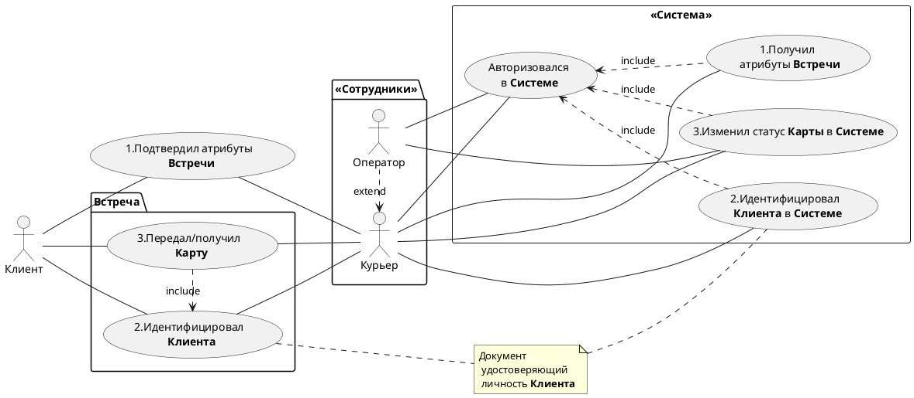

## Домашнее задание по UML
# Use Case

```plantuml
@startuml

left to right direction
:Клиент: as C
Package "<<Сотрудники>>"{
:Курьер: as D
:Оператор: as O
}
Rectangle "<<Система>>" {
(Авторизовался\n в **Системе**) as (UC0)
(1.Получил \n атрибуты **Встречи**) as (UC1) 
(2.Идентифицировал \n **Клиента** в **Системе**) as (UC4)
(3.Изменил статус **Карты** в **Системе**) as (UC6)
}

(1.Подтвердил атрибуты \n **Встречи**) as (UC2)
Package Встреча {
(2.Идентифицировал \n **Клиента**) as (UC3)
(3.Передал/получил \n **Карту**) as (UC5)
}

D -- UC0
D -- UC1
D -up- UC2
C -- UC2
D -up- UC3
C -- UC3
D -- UC4
D -up- UC5
C -- UC5
D -- UC6
O -- UC0
O -- UC6

(UC0) <.. (UC1) : include
(UC0) <.. (UC4) : include
(UC0) <.. (UC6) : include
(UC3)<.left.(UC5) : include
O .left.> D : extend

Note "Документ\n удостоверяющий\n личность **Клиента**" as N1
UC3 .. N1
N1 .. UC4

@enduml
```
