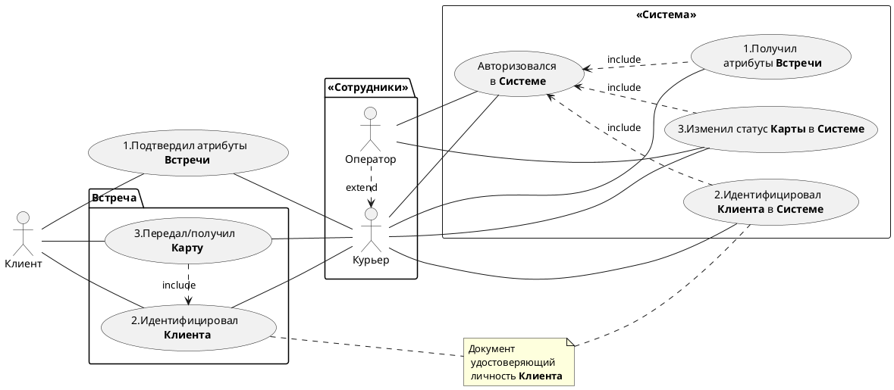
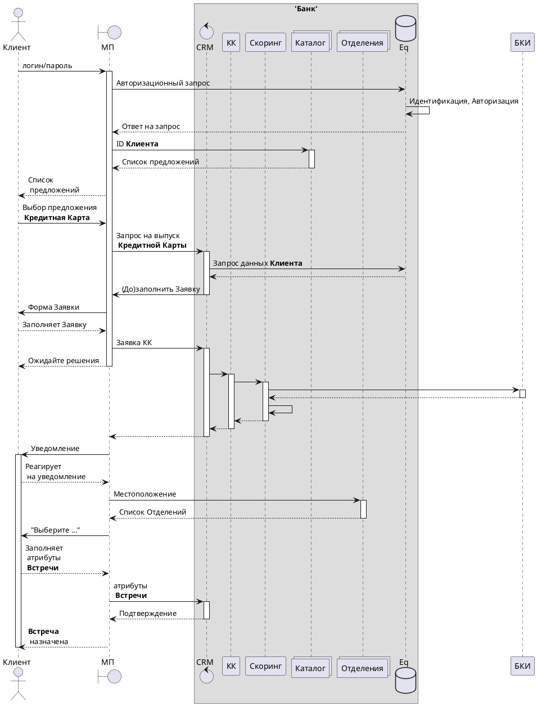

## Домашнее задание по UML
# Use Case

```plantuml
@startuml

left to right direction
:Клиент: as C
Package "<<Сотрудники>>"{
:Курьер: as D
:Оператор: as O
}
Rectangle "<<Система>>" {
(Авторизовался\n в **Системе**) as (UC0)
(1.Получил \n атрибуты **Встречи**) as (UC1) 
(2.Идентифицировал \n **Клиента** в **Системе**) as (UC4)
(3.Изменил статус **Карты** в **Системе**) as (UC6)
}

(1.Подтвердил атрибуты \n **Встречи**) as (UC2)
Package Встреча {
(2.Идентифицировал \n **Клиента**) as (UC3)
(3.Передал/получил \n **Карту**) as (UC5)
}

D -- UC0
D -- UC1
D -up- UC2
C -- UC2
D -up- UC3
C -- UC3
D -- UC4
D -up- UC5
C -- UC5
D -- UC6
O -- UC0
O -- UC6

(UC0) <.. (UC1) : include
(UC0) <.. (UC4) : include
(UC0) <.. (UC6) : include
(UC3)<.left.(UC5) : include
O .left.> D : extend

Note "Документ\n удостоверяющий\n личность **Клиента**" as N1
UC3 .. N1
N1 .. UC4

@enduml
```

# Sequence (черновик)

```plantuml
@startuml
Actor Клиент
Boundary МП
box 'Банк'
Control CRM 
Participant КК
Participant Скоринг
Collections Каталог
Collections Отделения
Database Eq
end box
Participant БКИ

Клиент -> МП ++ : логин/пароль
МП -> Eq : Авторизационный запрос
Eq -> Eq : Идентификация, Авторизация
МП <--Eq : Ответ на запрос
МП -> Каталог ++ : ID **Клиента**
Каталог --> МП -- : Список предложений
Клиент <-- МП : Список\n предложений

Клиент -> МП : Выбор предложения\n **Кредитная Карта**
МП -> CRM ++: Запрос на выпуск\n **Кредитной Карты**
CRM -> Eq : Запрос данных **Клиента**
CRM <-- Eq : 

CRM -> МП --: (До)заполнить Заявку
МП -> Клиент : Форма Заявки
Клиент --> МП : Заполняет Заявку
МП -> CRM ++ : Заявка КК
Клиент <-- МП -- : Ожидайте решения

CRM -> КК ++  
КК -> Скоринг ++
Скоринг -> БКИ ++
Скоринг <-- БКИ --
Скоринг -> Скоринг
КК <-- Скоринг --
CRM <-- КК --
МП <-- CRM --

МП -> Клиент ++ : Уведомление
Клиент --> МП : Реагирует\n на уведомление
МП -> Отделения ++ : Местоположение
Отделения --> МП -- : Список Отделений
МП -> Клиент : "Выберите ..."
Клиент --> МП : Заполняет\n атрибуты\n **Встречи**
МП -> CRM ++ : атрибуты\n **Встречи**
CRM --> МП --: Подтверждение
Клиент <-- МП -- : **Встреча**\n назначена
Клиент --

@enduml
```

